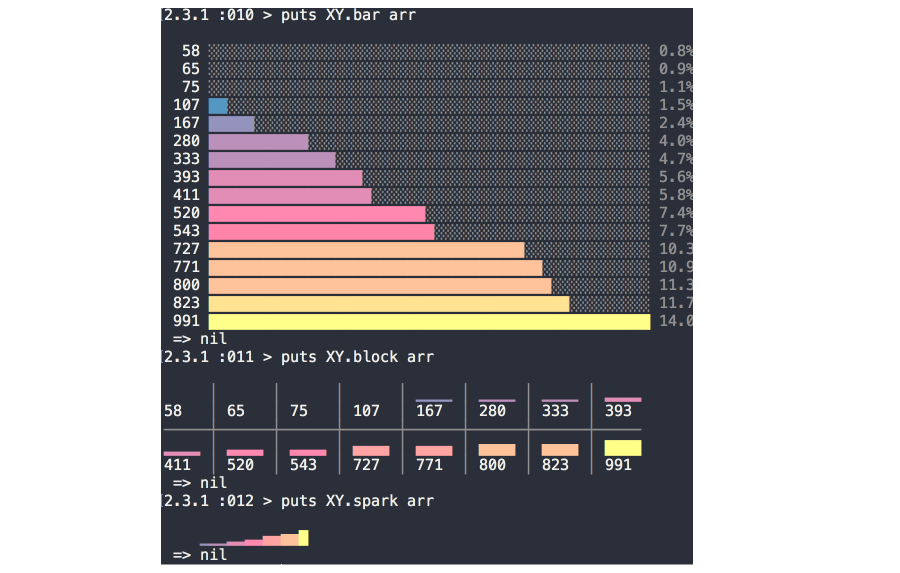

# XY

charts for numerical arrays in the terminal




## Usage

### XY.bar(array)

```shell
2.3.1 :014 > puts XY.bar rand(32).times.map { rand(32) }

   5 ███████░░░░░░░░░░░░░░░░░░░░░░░░░░░░░░░░░░░░░░░░░░ 3.6%
  14 █████████████████████████░░░░░░░░░░░░░░░░░░░░░░░░ 10.2%
  23 ███████████████████████████████████████████░░░░░░ 16.8%
  26 █████████████████████████████████████████████████ 19.0%
  10 █████████████████░░░░░░░░░░░░░░░░░░░░░░░░░░░░░░░░ 7.3%
   3 ███░░░░░░░░░░░░░░░░░░░░░░░░░░░░░░░░░░░░░░░░░░░░░░ 2.2%
  24 █████████████████████████████████████████████░░░░ 17.5%
   1 ░░░░░░░░░░░░░░░░░░░░░░░░░░░░░░░░░░░░░░░░░░░░░░░░░ 0.7%
  21 ███████████████████████████████████████░░░░░░░░░░ 15.3%
  10 █████████████████░░░░░░░░░░░░░░░░░░░░░░░░░░░░░░░░ 7.3%
 => nil
```

### XY.spark(array)

```shell
 2.3.1 :003 > puts XY.spark rand(32).times.map { rand(32) }

 ▂▂▃▆▆▅█▂
  => nil

```

### XY.block(array)

```shell

  puts XY.block rand(32).times.map { rand(32) }

▄▄▄▄ │      │ ▂▂▂▂ │ ▃▃▃▃ │ ▁▁▁▁ │ ▆▆▆▆ │ ▂▂▂▂ │ ▃▃▃▃ │      │ ▁▁▁▁
19   │ 3    │ 10   │ 14   │ 6    │ 24   │ 12   │ 13   │ 0    │ 9   
─────┼──────┼──────┼──────┼──────┼──────┼──────┼──────┼──────┼─────
     │ ▄▄▄▄ │ ▇▇▇▇ │ ████ │ ▇▇▇▇ │ ▄▄▄▄ │ ▆▆▆▆ │ ▃▃▃▃ │ ▃▃▃▃ │ ▁▁▁▁
3    │ 18   │ 28   │ 29   │ 28   │ 17   │ 25   │ 15   │ 14   │ 5   
─────┼──────┼──────┼──────┼──────┼──────┼──────┼──────┼──────┼─────
▇▇▇▇ │ ▅▅▅▅ │ ▁▁▁▁ │ ▃▃▃▃ │ ▃▃▃▃ │ ▅▅▅▅ │ ▂▂▂▂ │ ▂▂▂▂ │ ▇▇▇▇
26   │ 22   │ 9    │ 13   │ 14   │ 22   │ 12   │ 12   │ 27  

```

### realtime sparklines

```shell
2.3.1 :113 > arr = []
2.3.1 :114 > n = 50
2.3.1 :115 > 20.times do
2.3.1 :116 >   n = n + 25 - rand(50)
2.3.1 :117?>   arr << n
2.3.1 :118?>   puts XY.chart :spark, arr
2.3.1 :119?>   sleep 0.2
2.3.1 :120?> end


█

█▆

█▆▂

▄▃▁█

▁▁▁▃█

▁▁▁▃█▄

▁▁▁▃█▄▂

▁▁▁▃█▄▂▇

▁▁ ▂▅▃▂▅█

▁▁ ▂▅▃▂▅█▅

▁▁ ▂▅▃▂▅█▅▆

▁▁ ▂▅▃▂▅█▅▆▄

▁▁ ▂▅▃▂▅█▅▆▄▂

▁▁ ▂▅▃▂▅█▅▆▄▂▁

▁▁ ▂▅▃▂▅█▅▆▄▂▁▂

▁▁ ▂▅▃▂▅█▅▆▄▂▁▂

▁▂▁▁▃▆▄▂▅█▆▆▄▃▁▃▁

▁▂▁▁▃▆▄▂▅█▆▆▄▃▁▃▁  

▁▂▂▁▃▆▄▂▅█▆▆▄▃▁▃▁   

```

## license
[MIT](./LICENSE)
